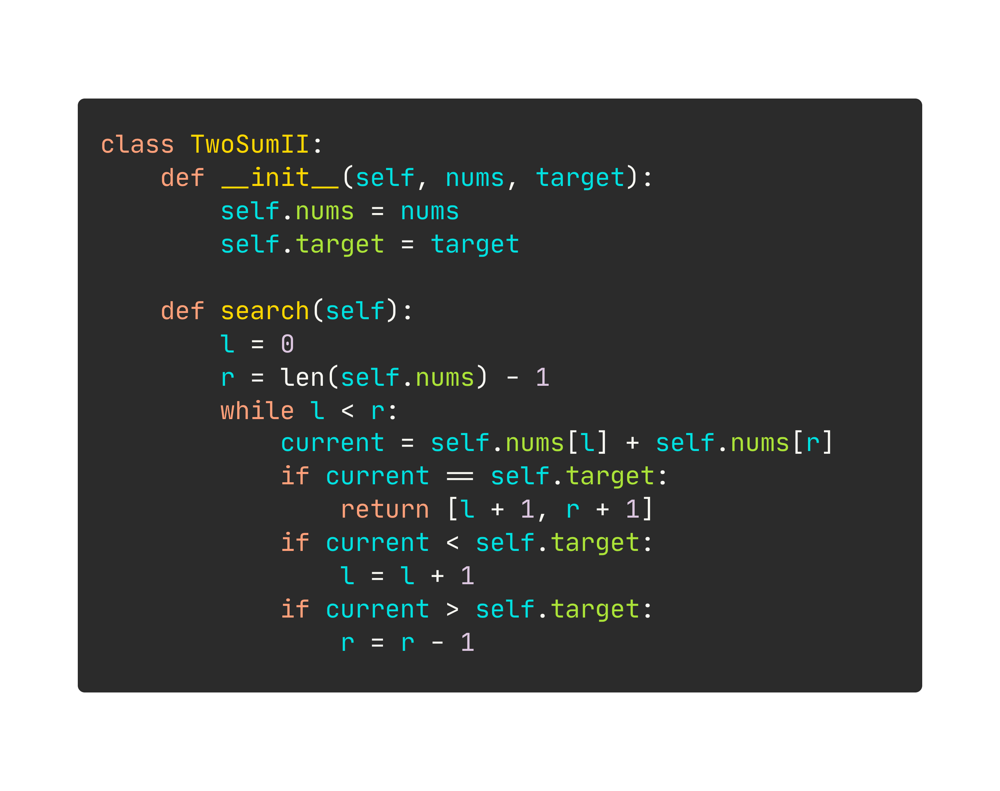

<h3 align="center">
	𓆩 𓂋 𓆪
	<br>
	HolyPython
</h3>

<table>
	<tr>
		<td><code>.py</code></td>
		<td><code>.hpy</code></td>
	</tr>
	<tr>
		<td></td>
		<td></td>
	</tr>
</table>

## Syntax

<table>
	<tr>
		<td><b>Python</b></td>
		<td><b>HolyPython</b></td>
		<td><b>Notes</b></td>
	</tr>
	<tr>
		<td><code>a == b</code></td>
		<td><code>a = b</code></td>
		<td></td>
	</tr>
	<tr>
		<td><code>a = b</code></td>
		<td><code>a <- b</code></td>
		<td></td>
	</tr>
	<tr>
		<td><code>[a, ..., b]</code></td>
		<td><code>[a..b]</code></td>
		<td>
			(<code>a</code>,<code>b</code>)
			non-decreasing <code>int</code>
		</td>
	</tr>
	<tr>
		<td><code>def f(): ...</code></td>
		<td><code>function f() { ... }</code></td>
		<td></td>
	</tr>
	<tr>
		<td><code>class C: ...</code></td>
		<td><code>class C { ... }</code></td>
		<td></td>
	</tr>
</table>

<!-- | Python         | HolyPython             | Note                          | -->
<!-- |----------------|------------------------|-------------------------------| -->
<!-- | `a == b`       | `a = b`                |                               | -->
<!-- | `a = b`        | `a <- b`               |                               | -->
<!-- | `[a, ..., b]`  | `[a..b]`               | `a`, `b` non-decreasing `int` | -->
<!-- | `def f(): ...` | `function f() { ... }` |                               | -->
<!-- | `class C: ...` | `class C { ... }`      |                               | -->

### Highlighting

**VSCode**

```sh
# Create extension
cd holypython/packages/vscode
npx --yes @vscode/vsce package

# Install extension
code --install-extension holypython-0.0.1.vsix
```

## Transpilation

### HolyPython-to-Python

```sh
cd holypython
python holypython.py foo.hpy
```
