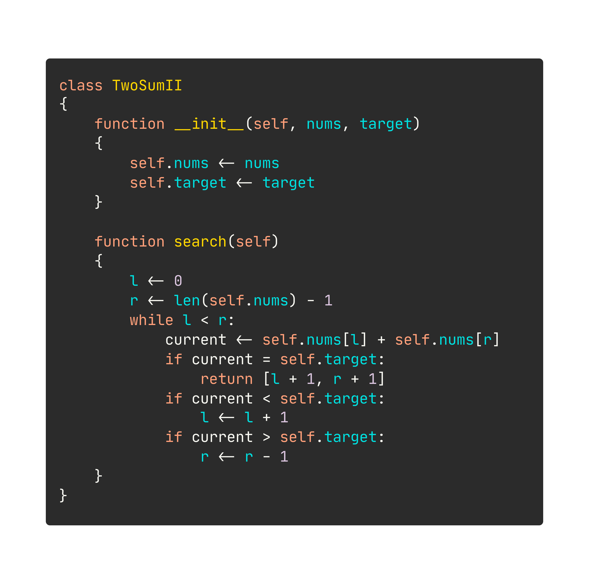

<h3 align="center">
	𓆩 𓂋 𓆪
	<br>
	HolyPython
</h3>

| `.hpy`                                    | → | `.py`                             |
|-------------------------------------------|---|-----------------------------------|
|  | → |  |

## Syntax

### Summary

| Python         | HolyPython             | Notes                                |
|----------------|------------------------|--------------------------------------|
| `a == b`       | `a = b`                |                                      |
| `a = b`        | `a <- b`               |                                      |
| `[a, ..., b]`  | `[a..b]`               | `type(a) == type(b) == int and a<=b` |
| `def f(): ...` | `function f() { ... }` |                                      |
| `class C: ...` | `class C { ... }`      |                                      |

### Highlighting

**VSCode**

```sh
# Create extension
cd holypython/packages/vscode
npx --yes @vscode/vsce package

# Install extension
code --install-extension holypython-0.0.1.vsix
```

## Transpilation

### HolyPython-to-Python

```sh
cd holypython
python holypython.py foo.hpy
```
